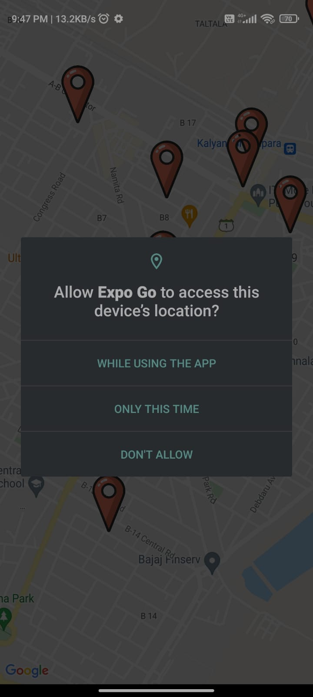
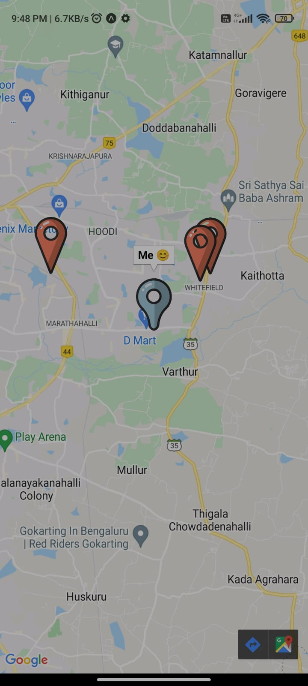
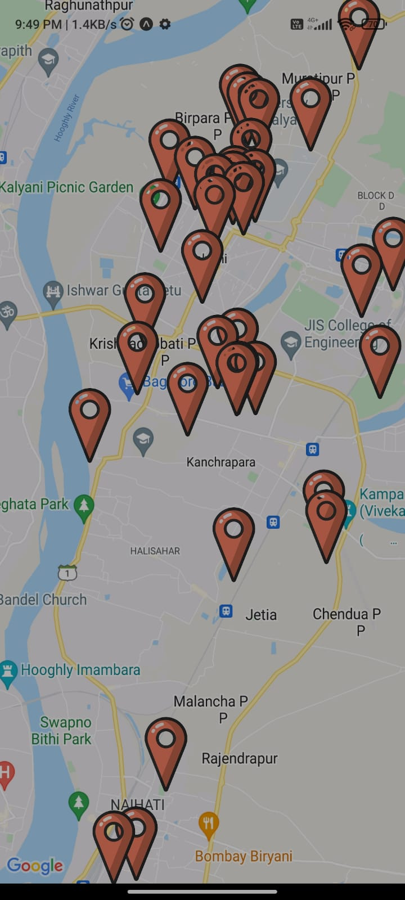

# Durga Puja Hopper

This app use to Find Durga Puja pandals near you


## Features

- Get the user current location using expo-location
- User can see nearbuy Durga Puja pandals
- App is fast and ofline 
- When user change their location then in app the corrent user location will change


## Installation

Install of durga-puja-hopper with npm

- Install Expo in your phone and  [Expo CLI](https://www.github.com/octokatherine) on your System


```bash
  git clone https://github.com/reo127/Durga-puja-hopper.git

  cd Durga-puja-hopper

  npm Install

  expo start
```

After that scan the QR code with you phone expo app
    
## Screenshots

 



